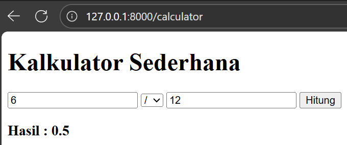

# Laporan Modul 2: Laravel Fundamentals

**Mata Kuliah:** Workshop Web Lanjut  
**Nama:** M. Hafidz Firansyah  
**NIM:** 2024573010019  
**Kelas:** TI.2C  

---

## Abstrak

Laporan ini membahas dasar penggunaan framework Laravel melalui percobaan membuat route, controller, dan view, serta membangun aplikasi sederhana berupa kalkulator. Tujuan praktikum ini adalah memahami konsep MVC pada Laravel dan bagaimana setiap komponennya saling terhubung dalam membentuk sebuah aplikasi web.

---

## 1. Dasar Teori

### a. MVC (Model, View, Controller)

- **Model**: Mengelola data dan logika bisnis aplikasi. Berhubungan langsung dengan database (CRUD).  
- **View**: Menyajikan data kepada pengguna dalam bentuk antarmuka (UI). Biasanya berupa file Blade di Laravel.  
- **Controller**: Perantara antara Model dan View. Menerima request dari pengguna, memproses data, lalu mengembalikan response melalui View.

### b. Routing di Laravel

Routing adalah proses mendefinisikan cara aplikasi merespons permintaan (request) dari URL tertentu. Semua rute didefinisikan dalam folder `routes/` (umumnya `web.php`). Routing menghubungkan URL dengan action berupa closure atau method di controller.

### c. Middleware

Middleware berfungsi sebagai filter untuk request yang masuk sebelum mencapai controller. Contoh: autentikasi, verifikasi CSRF token, logging request, dll. Middleware membantu menerapkan logika yang berulang secara efisien pada sekelompok route.

### d. Request dan Response di Laravel

1. Request masuk melalui `public/index.php`.  
2. Diteruskan ke **HTTP Kernel** yang memuat middleware global.  
3. Router mencocokkan request dengan route yang tersedia.  
4. Jika ada middleware khusus route, request melewatinya.  
5. Controller memproses logika, mungkin berinteraksi dengan Model.  
6. Controller menghasilkan Response (biasanya berupa View).  
7. Response dikirim kembali ke browser melalui middleware.

### e. Peran Controller dan View

- **Controller**: Menangani logika bisnis, alur request, dan koordinasi antar komponen.  
- **View**: Menampilkan data dengan antarmuka HTML tanpa logika bisnis kompleks.

### f. Blade Templating Engine

Blade adalah engine templating Laravel dengan sintaks sederhana.  
Fitur utama:  
- Menampilkan data dengan `{{ $variable }}` (aman dari XSS).  
- Struktur kontrol dengan `@if`, `@foreach`, dll.  
- Pewarisan template (`@extends`, `@yield`, `@section`).  
- Komponen & slot untuk membuat UI reusable.

---

## 2. Langkah-Langkah Praktikum

### 2.1 Praktikum 1 -- Route, Controller, dan Blade View

1. Menambahkan route pada `routes/web.php`:  
   

2. Membuat controller `WelcomeController`:  
     
   Isi file Controller:  
   

3. Membuat view `resources/views/mywelcome.blade.php`:  
   

4. Menjalankan aplikasi di browser.  
   Mengakses `http://localhost:8000/welcome` menampilkan halaman "Selamat Datang di Laravel!".  

   

---

### 2.2 Praktikum 2 -- Membuat Aplikasi Sederhana "Calculator"

1. Menambahkan route pada `routes/web.php`:  
   

2. Membuat controller `CalculatorController`:  
     
   Isi file Controller:  
     
   

3. Membuat view `resources/views/calculator.blade.php`:  
     
   

4. Menjalankan aplikasi:  
     
     
     
   

---

## 3. Hasil dan Pembahasan

1. **Apakah aplikasi berjalan sesuai harapan?**  
   Ya, aplikasi berjalan sesuai harapan. Route berhasil menampilkan halaman welcome, dan kalkulator dapat menjalankan operasi dasar.  

2. **Apa yang terjadi jika ada input yang salah (misalnya pembagian dengan 0)?**  
   Aplikasi menampilkan error karena belum ada penanganan khusus.  

3. **Bagaimana validasi input bekerja di Laravel?**  
   Laravel menyediakan fitur validasi bawaan. Dengan validasi, input yang tidak sesuai (kosong atau pembagian 0) bisa dicegah sebelum diproses.  

4. **Apa peran masing-masing komponen (Route, Controller, View) dalam program yang dibuat?**  
   - **Route**: menghubungkan URL dengan aksi tertentu.  
   - **Controller**: menangani logika perhitungan dan alur aplikasi.  
   - **View**: menampilkan hasil perhitungan dengan antarmuka yang mudah dipahami.  

---

## 4. Kesimpulan

Praktikum ini membantu memahami alur kerja Laravel berbasis MVC. Dengan memanfaatkan route, controller, dan view, aplikasi web dapat dibuat lebih terstruktur dan mudah dikelola. 

---

## 5. Referensi

1. Laravel 11.x Documentation -- The Basics -- <https://laravel.com/docs/11.x/routing>  
2. TutorialsPoint -- Laravel -- Quick Guide -- <https://www.tutorialspoint.com/laravel/laravel_quick_guide.htm>  
